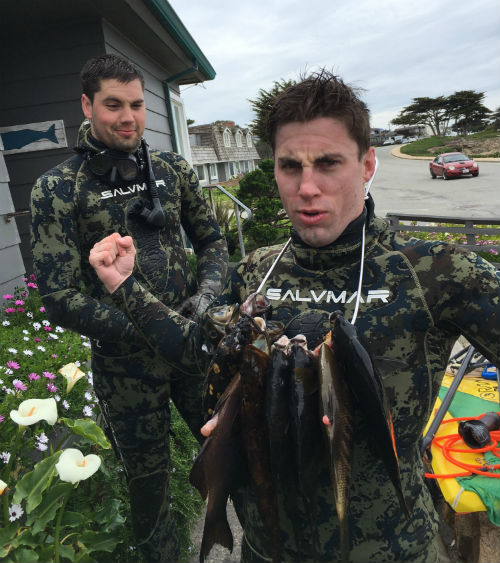

{: .center-image}

We are Calvin & Oscar Hawkes from [Monterey, CA](https://goo.gl/maps/Hh4mug5jk4S2). Oscar is 3 years younger, but 5 inches taller, so Calvin thinks it's a wash.

In 2016, Oscar bought his first speargun and the rest is history. Turns out, fishing is much more fun when you are trying to shoot the fish with a sort of modified crossbow. No longer we're we stuck on the surface with a pole in our hands, hoping a fish would bite the hook. We could _actively_ hunt fish, holding our breath and tracking them down through any hole or crevice we could find.

As we started to get deeper and more involved in the sport, we realized there was a serious lack of information about the sport online. It seems everytime I had a question, the result was a 5-year old forum post or some sketchy looking website from the '90s. So we created SpearHunters. A modern, up-to-date guide to spearfishing. We wrote these guides in hopes that other speros will find the information as useful as we did.

Enjoy!

